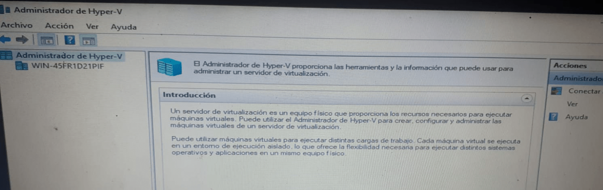
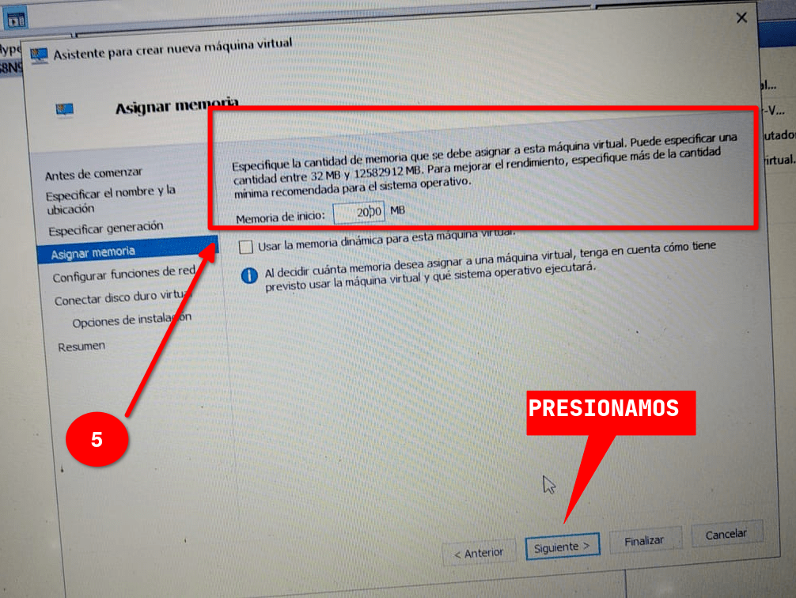

## Documentación
### Instalacion de un SO en `Hiper-V`
1. Abrimos el administrador de **Hiper-V**

2. Seleccionamos la opcion

3. Configuramos el adaptador de red
	- **`1: asignamos un nombre a nuestro adaptador`**
	- **`2: seleccionamos la opcion de red externa, seguidamente seleccionamos nuestro controlador de red`**

4. Creamos la maquina virtual
	- **`1: seleccionamos en el menu de acciones "nuevo"`**
	- **`2: seleccionamos "Maquina virtual"`**

	- **`3: agregamos un nombre a nuestra maquina virtual y presionamos "siguiente"`**

	- **`4: elegimos la generacion para nuestra maquina virtual y presionamos "siguiente"`**

	- **`5: asignamos cuanto de memoria RAM tendra nuestra maquina virtual y presionamos "siguiente"`**

	- **`6: seleccionamos nuestro adaptador de red para nuestra maquina virtual y presionamos "siguiente"`**

	- **`7: asignamos el tamaño de almacenamiento que tendra nuestra maquina virtual y presionamos "siguiente"`**

	- **`8: seleccionamos la opcion "instalar un S.O. mas adelante" y presionamos "siguiente"`**

	- **`9: tenemos una descriptcion de la maquina virtual que estamos a punto de crear y presionamos "finalizar"`**

5. Descargamos la imagen iso Para nuestro SO que instalaremos.

6. Realizamos doble click a nuestra maquina que creamos anteriormente.

7. Accedemos al menu de archivo y seleccionamos configuraciones.

8. Igresamos al menu de controladora SCID, selecionamos nuestra ISO y guardamos cambios.

9. Damos click en iniciar.

10. Realizamos la instalacion del SO.

11. Realizamos la configuracion para conectarnos via SSH a nuestra maquia virtual.

12. Nos conectarnos mediante SSH
- Realizamos la conexion:
	
	
	
	
